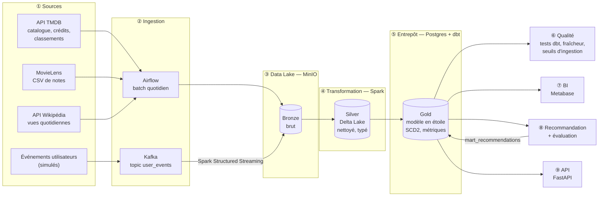
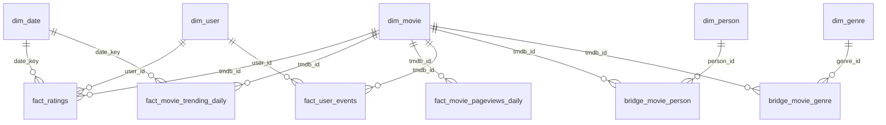
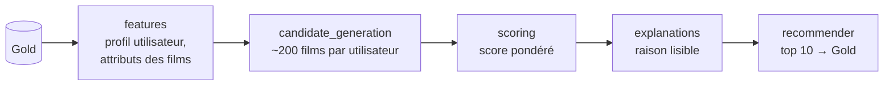
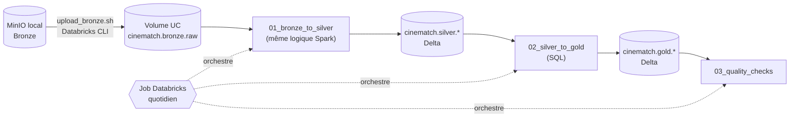

# 🎬 CineMatch — Architecture de la plateforme de données

> Projet de fin d'études — Data Engineering.
> Objectif : une plateforme de données capable de tourner automatiquement « comme en production »,
> qui alimente un système de découverte de films (goûts, acteurs, réalisateurs, tendances).

---

## 1. Vue d'ensemble



Le tout est **orchestré par Airflow**, **conteneurisé avec Docker Compose** et **validé par une CI GitHub Actions**.

**Stratégie de déploiement (option hybride)** : la plateforme **locale** (Docker) est la version de référence, celle de la soutenance. La logique Spark et Delta Lake est ensuite **portée sur Databricks Free Edition** pour prouver qu'elle fonctionne aussi dans le cloud (voir §17).

---

## 2. Sources de données

| Source | Type | Fréquence | Contenu | Rôle métier |
|---|---|---|---|---|
| **API TMDB** | API REST (JSON) | Quotidienne | Films, genres, durée, langue, notes, acteurs, réalisateurs, classement *trending* du jour | Catalogue + premier signal de tendance |
| **MovieLens** (`ml-latest-small`) | Fichiers CSV | Une seule fois (snapshot) | ~100 000 notes, 610 utilisateurs, table de liens vers TMDB | Historique et goûts des utilisateurs |
| **API Wikipédia Pageviews** | API REST (JSON) | Quotidienne, incrémentale | Vues quotidiennes de la page de chaque film | Signal de tendance indépendant |
| **Événements utilisateurs** | Flux Kafka | Continu | Recherches, consultations, bandes-annonces, ajouts en liste, notes | Temps réel : « ce film monte maintenant » |

**Clé de jointure entre les sources** : `tmdb_id`. MovieLens la fournit via `links.csv`, et Wikipédia y est relié grâce à Wikidata (propriété P4947).

**Événements simulés** : un générateur produit des événements réalistes. Un petit groupe de films « chauds », qui change régulièrement, reçoit plus d'activité, ce qui permet de tester la détection des films émergents.

---

## 3. Ingestion

### Batch (Airflow)
- Appels d'API avec **reprises automatiques** (backoff sur les erreurs 429/5xx).
- Écriture **brute** dans Bronze, sans transformation.
- **Idempotence** : relancer un jour remplace entièrement sa partition, sans créer de doublons.
- **Contrôle à la source** : si plus de 10 % des appels échouent, la tâche échoue au lieu de propager des données incomplètes.

### Streaming (Kafka + Spark)
- Topic `user_events`, avec le `tmdb_id` comme clé de message.
- Spark Structured Streaming lit Kafka et écrit dans Bronze (Delta).
- Mode **micro-batch planifié** (`availableNow`) : toutes les 15 minutes, le job traite les nouveaux messages depuis le dernier *checkpoint*, puis s'arrête. On garde la sémantique *exactly-once* du streaming, et le job reste orchestrable par Airflow.

---

## 4. Stockage : architecture en couches (médaillon)

| Couche | Stockage | Format | Contenu | Produite par |
|---|---|---|---|---|
| **Bronze** | MinIO (S3) | JSON / CSV / Delta | Données brutes, identiques à la source | Ingestion |
| **Silver** | MinIO (S3) | **Delta Lake** | Données aplaties, typées, dédoublonnées | Spark |
| **Gold** | PostgreSQL | Tables relationnelles | Modèle dimensionnel, historique, métriques | dbt |

### Organisation du data lake
```
lakehouse/
├── bronze/
│   ├── tmdb/movie_details/ingest_date=YYYY-MM-DD/
│   ├── tmdb/trending/ingest_date=YYYY-MM-DD/
│   ├── movielens/{ratings,movies,links,tags}/snapshot=ml-latest-small/
│   ├── wikipedia/pageviews/ingest_date=YYYY-MM-DD/
│   └── events/user_events/event_date=YYYY-MM-DD/
├── silver/
│   ├── tmdb_movies/            tmdb_movie_genres/
│   ├── tmdb_movie_people/      tmdb_trending_daily/
│   ├── movielens_ratings/      movielens_links/
│   ├── wiki_pageviews_daily/   user_events/
└── _checkpoints/               (état du streaming)
```

---

## 5. Transformations

### Bronze → Silver (Spark, ETL)
- Aplatissement du JSON imbriqué : un film devient plusieurs tables (film, genres, personnes).
- Seuls les 15 premiers rôles du casting sont gardés, plus les réalisateurs.
- Typage (dates, entiers, décimaux) et dédoublonnage sur les clés métier.
- **MERGE Delta** (upsert) : seules les lignes nouvelles ou modifiées sont écrites.
- Publication des tables Silver dans Postgres (schéma `silver`), point d'entrée de dbt.

### Silver → Gold (dbt, ELT)
Trois niveaux dans Postgres :
1. **staging** : nettoyage léger (par exemple, une durée de 0 devient « inconnue ») et jointure MovieLens ↔ TMDB.
2. **snapshots** : historisation **SCD type 2** des films (évolution de la note, du statut…).
3. **marts** : modèle en étoile et métriques métier.

---

## 6. Modèle de données Gold (dimensionnel)



### Dimensions
| Table | Grain | Particularité |
|---|---|---|
| `dim_movie` | 1 ligne par **version** de film | **SCD2** (`valid_from`, `valid_to`, `is_current`), tranche de durée (< 1h30, 1h30-2h, > 2h) |
| `dim_person` | 1 ligne par personne | Acteurs et réalisateurs |
| `dim_genre` | 1 ligne par genre | — |
| `dim_user` | 1 ligne par utilisateur | Préférences agrégées (genres favoris, acteurs suivis) |
| `dim_date` | 1 ligne par jour | Week-end, mois, trimestre |

### Tables de pont (relations plusieurs-à-plusieurs)
| Table | Rôle |
|---|---|
| `bridge_movie_person` | Film ↔ personne, avec le rôle (acteur / réalisateur) et l'ordre au générique. **Base des parcours de découverte par acteur ou réalisateur.** |
| `bridge_movie_genre` | Film ↔ genre |

### Faits
| Table | Grain | Chargement |
|---|---|---|
| `fact_ratings` | 1 note par utilisateur × film | Incrémental |
| `fact_movie_trending_daily` | 1 ligne par jour × film (rang tendance) | Incrémental |
| `fact_movie_pageviews_daily` | 1 ligne par jour × film | Incrémental |
| `fact_user_events` | 1 ligne par événement | Incrémental (depuis le streaming) |

### Métriques
| Table | Contenu |
|---|---|
| `mart_movie_momentum` | **Score de dynamique** = moyenne sur 7 jours / moyenne sur 28 jours, combinant la popularité TMDB, les vues Wikipédia et les événements. Un score > 1 signifie que le film gagne en attention : c'est un **film émergent**. |
| `mart_recommendations` | Recommandations par utilisateur, avec la **raison** (« même réalisateur que… », « en forte progression », « moins de 2h »). |

---

## 7. Qualité des données

| Niveau | Contrôle | Comportement en cas d'échec |
|---|---|---|
| Ingestion | Taux d'échec des appels d'API > 10 % | La tâche échoue |
| Sources | **Fraîcheur** : données Silver de plus de 2 jours | Avertissement |
| Gold | Unicité et non-nullité des clés | **Bloque le pipeline** |
| Gold | Valeurs acceptées (rôle, nom de classement) | Bloque |
| Gold | Plages (note entre 0,5 et 5, durée entre 1 et 600 min) | Bloque |
| Gold | Intégrité référentielle (faits → dimensions) | Bloque ou avertit selon la table |
| Gold | Une seule version active par film (SCD2) | Bloque |

Les tests sont exécutés à chaque run par `dbt build`. Un modèle dont les tests échouent ne propage pas ses données vers l'aval.

---

## 8. Orchestration (Airflow)

### DAG `cinematch_batch_daily` (quotidien)
```
ingest_movielens → ingest_tmdb → ingest_wikipedia
      → silver_movielens → silver_tmdb → silver_wikipedia
      → dbt_source_freshness → dbt_build (modèles + tests) → dbt_docs (lignage)
```
- 2 reprises automatiques par tâche, avec 5 minutes d'intervalle.
- Exécution séquentielle des jobs Spark, pour tenir sur un portable de 8 Go.

### DAG `cinematch_events_stream` (toutes les 15 minutes)
```
kafka_to_bronze → silver_events → (incrémental dbt des faits d'événements)
```

### DAG `cinematch_recommendations` (quotidien, après le batch)
```
build_features → generate_candidates → score_and_explain
      → offline_evaluation → publish_recommendations (Gold)
```
- La publication est **bloquée** si les métriques d'évaluation passent sous un seuil (voir §16).

---

## 9. Gestion de l'incrémental et des changements de schéma

| Couche | Incrémental | Changement de schéma |
|---|---|---|
| Bronze | Partition par date d'ingestion, réécrite si on relance le même jour | Aucun impact (stockage brut) |
| Silver | MERGE Delta sur les clés métier | Évolution automatique du schéma Delta (une nouvelle colonne est ajoutée) |
| Gold | Modèles dbt incrémentaux (filtre sur la date max déjà chargée) | Option `on_schema_change` : ajout des nouvelles colonnes |
| Streaming | Checkpoints Spark | Message brut conservé en Bronze, donc il peut être retraité |

---

## 10. Monitoring et lignage

- **Lignage** : graphe généré par `dbt docs`, qui montre les dépendances des sources jusqu'aux marts.
- **Logs** : centralisés dans Airflow pour chaque tâche.
- **Supervision** : table de métriques des exécutions (durée, lignes traitées, tests en échec) et tableau de bord « santé des données » dans Metabase.
- **Alertes** : en cas d'échec d'une tâche Airflow (callback, e-mail ou Slack).

---

## 11. Déploiement (Docker Compose)

| Service | Rôle | Port | Profil |
|---|---|---|---|
| `postgres` | Entrepôt + métadonnées Airflow | 5433 | socle |
| `minio` | Data lake S3 | 9000 / 9001 (console) | socle |
| `airflow-webserver` | Interface Airflow | 8080 | socle |
| `airflow-scheduler` | Exécution des tâches (Spark en mode local) | — | socle |
| `kafka` | Broker de messages (KRaft, sans Zookeeper) | 29092 | `streaming` |
| `event-producer` | Générateur d'événements | — | `streaming` |
| `metabase` | Tableaux de bord | 3000 | `bi` |
| `api` | API FastAPI (lecture seule sur Gold) | 8000 | `api` |

Le socle démarre avec une seule commande ; les profils `streaming`, `bi` et `api` s'ajoutent au besoin.

---

## 12. CI/CD (GitHub Actions)

À chaque push :
1. **Lint et tests unitaires** Python (`tests/unit/` : ingestion, producteur, scoring, métriques).
2. **Tests d'intégration** (`tests/integration/`) : tous les DAGs Airflow se chargent sans erreur.
3. **Validation dbt** : le projet doit compiler.
4. **Validation Docker Compose** : la configuration doit être valide.

---

## 13. Arborescence prévue du dépôt

```
cinematch/
├── airflow/dags/          DAGs batch, streaming, recommandations
├── src/cinematch/
│   ├── ingestion/         TMDB, MovieLens, Wikipédia → Bronze
│   ├── transform/         Spark : Bronze → Silver
│   ├── streaming/         producteur, consommateur Spark, schéma des événements
│   ├── recommendation/    candidats → features → score → explication
│   ├── evaluation/        jeux de test, évaluation hors ligne, métriques
│   └── api/               FastAPI : routes + schémas de réponse
├── databricks/            portage cloud : notebooks, job, Asset Bundle (§17)
├── dbt/
│   ├── models/staging/
│   ├── snapshots/         SCD2
│   ├── models/marts/      étoile + métriques
│   └── tests/
├── docker/                images Airflow, API, initialisation Postgres
├── tests/                 unit/, integration/, fixtures/
├── docs/                  ADR, schémas, dictionnaire de données, qualité, feuille de route
├── .github/workflows/     CI
└── docker-compose.yml
```

---

## 14. Choix techniques

| Besoin | Choix | Justification |
|---|---|---|
| Orchestration | Apache Airflow | Standard du marché, très demandé en stage |
| Data lake | MinIO | Compatible S3, donc le même code tourne sur AWS |
| Format de table | Delta Lake | MERGE, transactions ACID, évolution de schéma, historique (*time travel*) |
| Traitement | Apache Spark | Batch et streaming avec le même moteur |
| Messagerie | Apache Kafka | Référence du streaming |
| Modélisation | dbt | SQL versionné, tests, documentation et lignage intégrés |
| Entrepôt | PostgreSQL | Léger, compatible avec dbt et Metabase |
| BI | Metabase | Installation en un conteneur, simple à prendre en main |
| API | FastAPI | Typée, documentation OpenAPI automatique, rapide à écrire |
| Portage cloud | Databricks Free Edition | Plateforme très demandée en entreprise ; elle reprend Spark, Delta et l'architecture médaillon |

Les décisions détaillées sont dans [docs/adr/](docs/adr/) ; le planning est dans [docs/roadmap.md](docs/roadmap.md).

---

## 15. Correspondance avec la grille du sujet

| Compétence demandée | Où elle apparaît |
|---|---|
| Ingestion de 2 à 3 sources | 4 sources (§2) |
| Traitement batch | DAG quotidien (§8) |
| Traitement temps réel / streaming | Kafka + Spark Streaming (§3) |
| Data lake / lakehouse | MinIO + Delta, Bronze / Silver (§4) |
| Modélisation dimensionnelle | Étoile + SCD2 (§6) |
| ETL / ELT | Spark (ETL) + dbt (ELT) (§5) |
| Orchestration | Airflow (§8) |
| Tests de qualité des données | §7 |
| Traitement incrémental | §9 |
| Changements de schéma | §9 |
| Lignage | dbt docs (§10) |
| Monitoring et logs | §10 |
| Conteneurisation Docker | §11 |
| Tests automatisés / CI-CD | §12 |
| Tableaux de bord et SQL analytique | Metabase, marts (§6, §11) |
| Documentation | Ce document, ADR, dictionnaire de données, `data_quality.md` |

**16 compétences sur 16.**

---

## 16. Recommandation, évaluation et API

> Priorité : semaine 4 (valeur ajoutée). L'API est un bonus : Metabase suffit pour la démo.

### Pipeline de recommandation (`src/cinematch/recommendation/`)



| Étape | Rôle |
|---|---|
| **features** | Profil de chaque utilisateur (genres, acteurs et réalisateurs préférés d'après ses notes) et attributs des films (genres, personnes, durée, langue, note, score de dynamique) |
| **candidate_generation** | Plusieurs sources de candidats : films des mêmes acteurs ou réalisateurs (via `bridge_movie_person`), mêmes genres, films émergents (`mart_movie_momentum`), films populaires (pour les nouveaux utilisateurs) |
| **scoring** | Score = affinité de contenu + affinité acteurs / réalisateurs + bonus de dynamique + qualité (note), avec des poids configurables. Les films déjà vus sont exclus. |
| **explanations** | La composante dominante du score devient une phrase : « Avec Leonardo DiCaprio, que vous avez bien noté », « En forte progression cette semaine », « Moins de 2h » |
| **recommender** | Orchestration des étapes et écriture de `mart_recommendations` (utilisateur, film, rang, score, raison) |

**Démarrage à froid** : un utilisateur sans historique reçoit les films populaires et émergents, éventuellement filtrés par les genres choisis à l'inscription.

### Évaluation hors ligne (`src/cinematch/evaluation/`)

| Module | Rôle |
|---|---|
| **datasets** | Découpage **temporel** des notes MovieLens : pour chaque utilisateur, les 20 % de notes les plus récentes servent de test (pas de fuite du futur) |
| **offline** | Génère les recommandations sur l'historique d'entraînement et les compare aux notes de test |
| **metrics** | Precision@10, Recall@10, NDCG@10, couverture du catalogue, part de films émergents recommandés |

- **Baseline** : le modèle doit battre une recommandation « top popularité ».
- **Garde-fou** : si le NDCG@10 passe sous la baseline, le DAG ne publie pas les nouvelles recommandations.
- Les résultats sont historisés dans une table d'évaluation, pour suivre leur évolution d'une exécution à l'autre.

### API (`src/cinematch/api/`)

**Principe : l'API ne calcule rien, elle lit la couche Gold.** Les calculs restent dans les pipelines.

| Route | Rôle | Source Gold |
|---|---|---|
| `GET /movies/{tmdb_id}` | Fiche film (genres, acteurs, réalisateurs) | `dim_movie`, ponts |
| `GET /movies?genre=&max_runtime=&person=` | Recherche filtrée (ex. « thriller < 2h avec DiCaprio ») | `dim_movie`, ponts |
| `GET /recommendations/{user_id}` | Top 10 avec explications | `mart_recommendations` |
| `GET /trends/emerging` | Films émergents du moment | `mart_movie_momentum` |
| `GET /trends/people/{person_id}` | Parcours de découverte autour d'un acteur ou réalisateur | `bridge_movie_person` |

Les schémas de réponse (`api/schemas/` : `movie`, `recommendation`, `trend`) sont validés par Pydantic. La documentation est générée automatiquement sur `/docs`.

---

## 17. Portage sur Databricks (option hybride)

> Priorité : bonus, 1 à 2 jours, en fin de semaine 4 ou juste après.
> La plateforme locale reste la référence. Databricks montre que la même logique **fonctionne dans le cloud**.

### Principe clé : séparer la logique des entrées/sorties

Pour que le portage prenne quelques heures et pas une réécriture complète, les fonctions de `src/cinematch/transform/` sont écrites en deux parties :

| Partie | Rôle | Local | Databricks |
|---|---|---|---|
| **Logique** (« DataFrame en entrée → DataFrame en sortie ») | Aplatir, typer, dédoublonner | Identique | **Identique (même code)** |
| **Lecture / écriture** | Où se trouvent les données | `s3a://lakehouse/...` (MinIO) | Tables et volumes Unity Catalog |

Seule la seconde partie change : c'est elle qui rend le portage rapide.

### Correspondance local ↔ Databricks

| Rôle | Local (référence) | Databricks Free Edition |
|---|---|---|
| Stockage brut (Bronze) | MinIO, bucket `lakehouse` | **Volume** Unity Catalog `cinematch.bronze.raw` |
| Format des tables | Delta Lake | Delta Lake (natif) |
| Calcul | Spark local dans Docker | Calcul **serverless** |
| Organisation | Dossiers `bronze/`, `silver/` | **Catalogue** `cinematch` → schémas `bronze`, `silver`, `gold` |
| Transformation Bronze → Silver | `transform/silver_*.py` | Notebook `01_bronze_to_silver.py` (réutilise les mêmes fonctions) |
| Gold | dbt + Postgres | Notebook SQL `02_silver_to_gold.sql` (sous-ensemble) |
| Qualité | Tests dbt | Notebook `03_quality_checks.sql` (mêmes règles) |
| Orchestration | Airflow | **Job Databricks** (Workflows) |
| Déploiement | Docker Compose | **Databricks Asset Bundle** (`databricks.yml`) |
| Lignage | dbt docs | Lignage Unity Catalog (automatique) |

### Flux sur Databricks



### Contenu du dossier `databricks/`

| Fichier | Rôle |
|---|---|
| `README.md` | Pas-à-pas : création du compte, déploiement, captures d'écran |
| `databricks.yml` | Configuration de l'Asset Bundle (« infrastructure as code ») |
| `resources/cinematch_job.yml` | Définition du job : 3 tâches enchaînées et planification |
| `notebooks/00_setup_catalog.sql` | Création du catalogue, des schémas et du volume |
| `notebooks/01_bronze_to_silver.py` | Bronze → Silver avec les fonctions de `src/cinematch/transform/` |
| `notebooks/02_silver_to_gold.sql` | Gold : `dim_movie`, `bridge_movie_person`, `fact_ratings`, `mart_movie_momentum` |
| `notebooks/03_quality_checks.sql` | Unicité, non-nullité, plages de valeurs : le job échoue si un contrôle échoue |
| `scripts/upload_bronze.sh` | Copie d'un instantané de Bronze depuis MinIO vers le volume |

### Ce qui reste local, et pourquoi

| Élément | Raison |
|---|---|
| **Ingestion** (API TMDB, Wikipédia) | Le cloud ne voit pas les services locaux, et l'accès Internet sortant de la Free Edition est restreint (élargi après vérification LinkedIn). On transfère donc un instantané de Bronze. |
| **Streaming Kafka** | Un Kafka local n'est pas joignable depuis le cloud ; il faudrait un Kafka managé, hors périmètre. |
| **Recommandation, API, Metabase** | Ils lisent la couche Gold locale (Postgres). |

### Risques et parades

| Risque | Parade |
|---|---|
| Quota dépassé : calcul coupé pour la journée | Petit volume de données. **La démo de soutenance se fait sur la version locale.** |
| Écarts de syntaxe SQL entre Postgres et Databricks | Gold Databricks limité à 4 tables, réécrites en Spark SQL |
| Dépendance à un compte personnel | Captures d'écran et export du job dans `docs/images/` |

**Phrase pour un entretien** : *« La plateforme tourne en local avec Docker. J'ai séparé la logique de transformation des entrées/sorties, ce qui m'a permis de porter le pipeline Bronze → Silver → Gold sur Databricks (Unity Catalog, Workflows, Asset Bundles) en réutilisant le même code Spark. »*
